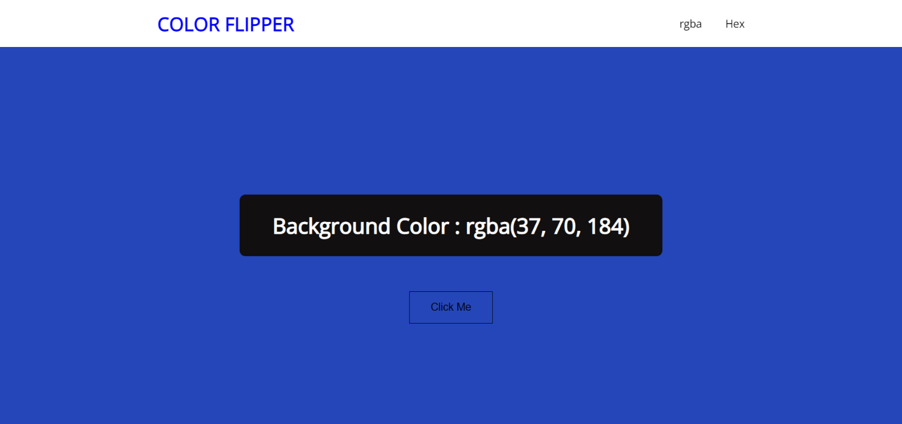

Live link - https://yokesh-ks.github.io/JavaScript_Projects/01-Color-Flipper/

Color Code Format
  1. rgba code - rgba(106, 90, 205)
  2. hex code - #f12505

For rgba generated a random number between 0 to 255.

For hex code generated a random index from [0, 1, 2, 3, 4, 5, 6, 7, 8, 9, "A", "B", "C", "D", "E", "F"];

The Document method querySelector() returns the first Element within the document that matches the specified selector, or group of selectors. If no matches are found, null is returned.
```
element = document.querySelector(selectors);
```

Math.random() function returns a floating-point, pseudo-random number in the range 0 to less than 1 (inclusive of 0, but not 1) with approximately uniform distribution over that range
```
MAth.random
// expected output: a number from 0 to <1
```
```
Math.random() * total_length
// Math.random * 255
```

Math.floor() function returns the largest integer less than or equal to a given number.

To get a Random number 
```
Math.floor(Math.random() * Length)
```

To change a background color
```
 document.body.style.backgroundColor = colors;
```
