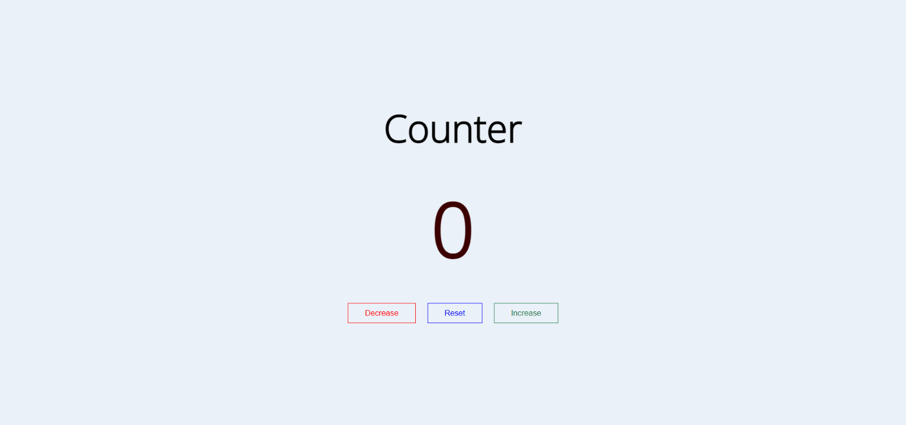

Document method querySelector() returns the first Element within the document that matches the specified selector, or group of selectors. If no matches are found, null is returned.
```
element = document.querySelector(selectors);
```

# EventTarget.addEventListener()
The EventTarget method addEventListener() sets up a function that will be called whenever the specified event is delivered to the target.

```
element.addEventListener("click", function(){

})
```

In this Project we have three button so we use querySelectorALl and used in forEach loop.

The Document method querySelectorAll() returns a static (not live) NodeList representing a list of the document's elements that match the specified group of selectors.

```
elementList = parentNode.querySelectorAll(selectors);
```

The forEach() method executes a provided function once for each array element.

```
elementList.forEach(function (element){
  element.addEventListener("click", function(e){
    const style = e.currentTarget.classList;
  })
}
```

The currentTarget read-only property of the Event interface identifies the current target for the event, as the event traverses the DOM. It always refers to the element to which the event handler has been attached, as opposed to Event.target, which identifies the element on which the event occurred and which may be its descendant.
```
var currentEventTarget = event.currentTarget;
```
