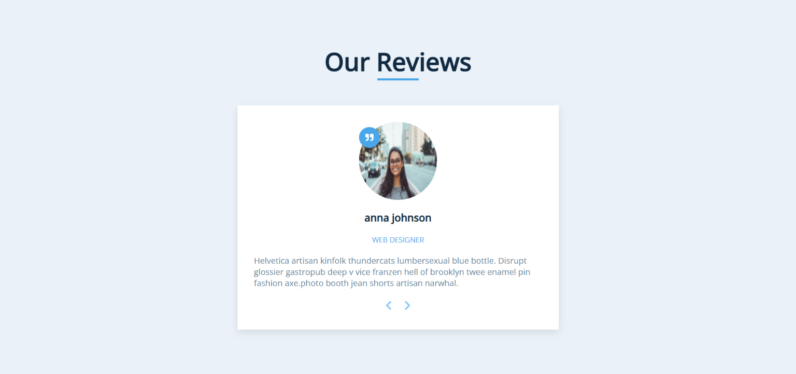

WebSite Link - https://yokesh-ks.github.io/JavaScript_Projects/03-Review-Carousel/
```
const img = document.querySelector(".person-img");
const author = document.getElementById("author");
const job = document.getElementById("job");
const info = document.getElementById("info");
const prevBtn = document.querySelector(".prev-btn");
const nextBtn = document.querySelector(".next-btn");
```

There are two button nextBtn and PrevBtn. Initailly currentItem = 0

```
nextBtn.addEventListener("click", function(){
    currentItem++;
    if (currentItem > reviews.length - 1) {
        currentItem = 0;
    }
    showPerson(currentItem);
});
```

```
prevBtn.addEventListener("click", function () {
    currentItem--;
    if (currentItem < 0) {
      currentItem = reviews.length - 1;
    }
    showPerson(currentItem);
  });
```

```
function showPerson(person) {
    const item = reviews[person];
    img.src = item.img;
    author.textContent = item.name;
    job.textContent = item.job;
    info.textContent = item.text;
}
```

## Window: DOMContentLoaded event

The Window interface represents a window containing a DOM document; the document property points to the DOM document loaded in that window.

The DOMContentLoaded event fires when the initial HTML document has been completely loaded and parsed, without waiting for stylesheets, images, and subframes to finish loading.

addEventListener() sets up a function that will be called whenever the specified event is delivered to the target.

```
window.addEventListener("DOMContentLoaded", function(){
    showPerson(currentItem);
});
```

